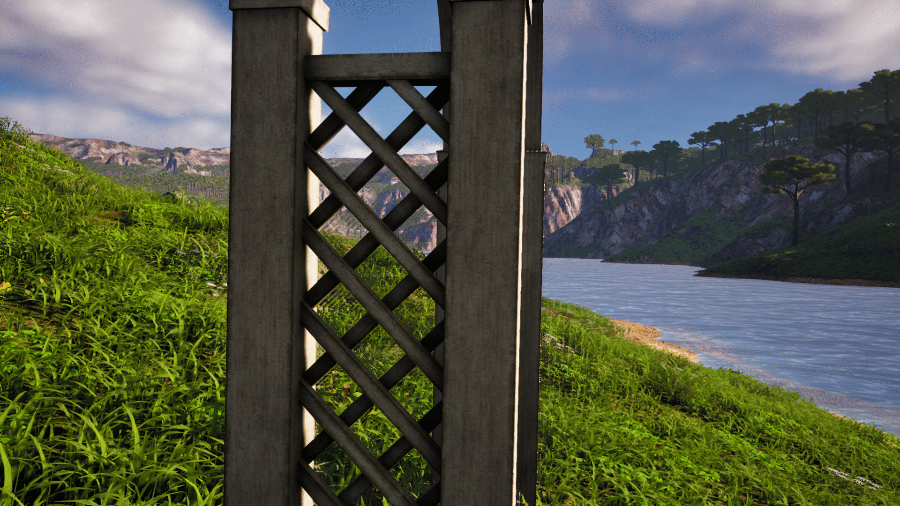

# REAL-TIME GAME ANTI-ALIASING TECHNIQUES USING DEEP NEURAL NETWORKS

<p align="center">

</p>

The main objective of this project is to research, analyze, and develop deep neural network-based anti-aliasing techniques for application in video games. Multiple models have been developed using different architectures such as CNN, UNet, and Transformer. These models not only focus on correcting ghosting but also address other common visual issues, including jagged edges, image sharpness enhancement, and the removal of various artifacts generated during rendering. To train and evaluate the models, an extensive dataset of images was collected from scenes designed from scratch in the Unreal Engine graphics engine. These images are preprocessed to serve as input for the models, which output improved versions with applied anti-aliasing and noticeably superior visual quality.

<p align="center">
  
  
</p>

<p align="center">
Ejemplo de ghosting producido por TAA. • Comparativa entre TAA y MSAA. • Ejemplo de una imagen renderizada con MSAA.
</p>

---

## Metodología

Para el desarrollo del proyecto, se siguió una **metodología ágil Scrum** con sprints de una a dos semanas.

El flujo de trabajo se estructuró en los siguientes pasos:

1. **Creación del Dataset**  
   Se diseñó y desarrolló un entorno virtual en **Unreal Engine 5** para generar un conjunto de datos sintético.  
   Se grabaron secuencias a **1920x1080p y 60 FPS**, capturando imágenes con **TAA** (como entrada para los modelos) y con **MSAA** (ground truth o referencia de alta calidad).

2. **Entrenamiento de los Modelos**  
   Se entrenaron y validaron varias arquitecturas de redes neuronales utilizando este dataset.  
   El entrenamiento intensivo se realizó en la **supercomputadora Picasso**.

3. **Evaluación de Resultados**  
   Se comparó el rendimiento de los modelos tanto cuantitativa como cualitativamente, enfocándose en métricas como el **PSNR** y la reducción del **ghosting** y otros artefactos.

---

## Arquitecturas Utilizadas

Se entrenaron y evaluaron las siguientes arquitecturas, especializadas en la restauración y superresolución de video e imagen:

- **EDVR (Enhanced Deformable Video Restoration):** red potente para restauración de video, utiliza alineación multiframe y mecanismos de atención.
- **BasicVSR++:** arquitectura basada en la propagación bidireccional de características.
- **VRT (Video Restoration Transformer):** utiliza *Transformers* para capturar dependencias espaciales y temporales.
- **DRUNet (Deep Residual U-Net):** combina principios de *U-Net* y *ResNet* para eliminación de ruido y restauración de imágenes.
- **NAFNet (Nonlinear Activation Free Network):** innovadora red que no requiere funciones de activación no lineales para lograr rendimiento de vanguardia.

---

## Resultados

Los resultados se evaluaron mediante **PSNR (Peak Signal-to-Noise Ratio)**, una métrica estándar que mide la calidad de reconstrucción.
<div align="center">

| Escena            | VRT   | EDVR  | BasicVSR++ | DRUNet | NAFNet |
|-------------------|-------|-------|------------|--------|--------|
| Escena 1 - Banco  | 23.89 | 25.00 | 16.70      | 23.14  | 26.16  |
| Escena 2 - Árbol  | 20.57 | 20.40 | 20.55      | 23.15  | 25.44  |
| Escena 3 - Helechos | 23.21 | 23.13 | 19.46    | 25.26  | 26.30  |
| Escena 4 - Lago   | 25.05 | 24.50 | 21.24      | 24.98  | 22.75  |
| Escena 5 - Arco 1 | 25.65 | 26.06 | 19.73      | 24.41  | 25.52  |
| Escena 6 - Arco 2 | 25.86 | 25.43 | 20.08      | 24.63  | 25.47  |
| Escena 7 - Mirador| 26.68 | 26.49 | 21.65      | 27.02  | 26.54  |

</div>


**Análisis de resultados:**
- **NAFNet** destacó al lograr los mejores resultados en la mayoría de las escenas, especialmente en superficies transparentes.  
- **EDVR** mostró excelente capacidad para eliminar aliasing y ghosting.  
- **VRT** resaltó por la nitidez de sus reconstrucciones.  
- **DRUNet** ofreció un rendimiento aceptable, aunque sin grandes mejoras perceptibles.  
- **BasicVSR++** tuvo el peor desempeño, degradando en ocasiones la calidad de la imagen de entrada.  

---

## Manual de Instalación

### Requisitos del sistema
- **SO:** Linux (también en Windows con soporte en WSL o Docker).
- **Python:** Recomendado Python entre 3.7 - 3.10 (Se recomienda el uso de entornos virtuales con Anaconda o Miniconda).
- **PyTorch:** 1.10 con soporte CUDA.
- **GPU:** NVIDIA con soporte CUDA (**mínimo 12 GB de VRAM** recomendado para entrenamiento).

## Instalación 

Todo el código fuente necesario para ejecutar y reproducir este proyecto se encuentra organizado en la carpeta TFG_AntiAliasing. Dicha carpeta puede descargarse desde el
siguiente <a href="https://drive.google.com/drive/folders/1nkHAZJ5TlYn7uwUizH8rhuJjfjGtI4VX">enlace</a>.

### Usando Miniconda o Anaconda:
```bash
conda create -n nombre_del_entorno python=3.9
conda activate nombre_del_entorno
```
### **IMPORTANTE:** Recomendado crear un entorno separado para BasicSR, KAIR y NAFNet.

## Para instalar las dependencias necesarias para los distintos modelos, consultar el documento "TFG_Antialiasing" sección "Manual de Instalación".
## Para entrenar, validar e inferir sobre los modelos, consultar el documento "TFG_Antialiasing" sección "Manual de Usuario".
